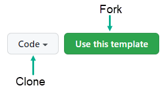

# VS2019/C# .NET Core 6

Learn how to use several `new features` of the `.NET Core 6 Framework` in `preview mode` with Visual Studio 2019 by following several steps to active the .NET Core 6 features.

Not all features are supported in Visual Studio 2019 as they will be in Visual Studio 2022 which needs to be understood.

### Setup to use .NET Core 6 with V2019


- Under Visual Studio options, set `use previews` of the .NET SDK.
-  Install the [SDK 6x](https://dotnet.microsoft.com/download/dotnet/6.0?WT.mc_id=DT-MVP-5002866)
- Create a new .NET Core project, model the project file as per below.

```xml
<Project Sdk="Microsoft.NET.Sdk">
	<PropertyGroup>
          <EnablePreviewFeatures>true</EnablePreviewFeatures>
          <LangVersion>preview</LangVersion>
          <OutputType>Exe</OutputType>
          <TargetFramework>net6.0</TargetFramework>
	</PropertyGroup>

	<ItemGroup>
           <PackageReference Include="System.Runtime.Experimental" Version="6.0.0-preview.7.21377.19" />
	</ItemGroup>
</Project>
```

### Clone or fork

This repository



### Data scripts

Several projects have data scripts to create and populate tables in a simple database. These scripts need to run before running the project with these scripts.

### Study

Take time to study the code in each code sample rather than simply copy-n-pasting code into your project.

